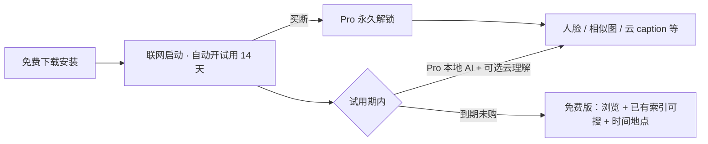
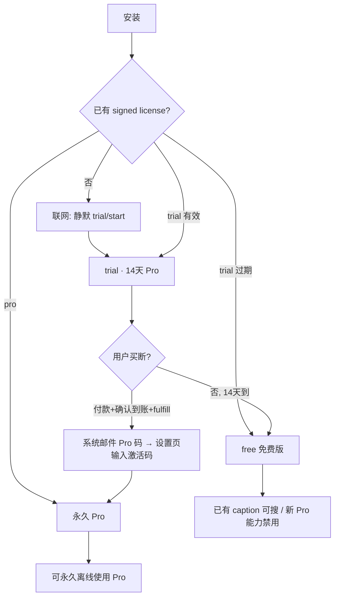

# 笑笑相册 · 产品商业化方案（免费试用 + 买断）

> 版本：v1.9 · 2026-07  
> 状态：产品/商业定稿（**M1 授权已实现**）  
> v1.9：**统一定价 ¥198**（自 2026-07 起）  
> v1.8：§9.1 官网文案已对齐实现；购买/激活路径统一为「**版本与激活**」  
> v1.7：试用改为 **安装联网自动开启**（按 **device_id**，无邮箱验证码）；Pro 兑换 **激活码 + 设备**；购买发码仍用邮箱（fulfill）  
> v1.6：**统一定价 ¥128**；移除早鸟/差价设计；购买说明模板更名  
> v1.5：验证期 Pro 发码 **半自动**（`admin/fulfill`）；购买入口在官网  
> v1.4：补充 **用户旅程摘要**、**许可证实现索引**；关联 `docs/许可证系统-研发设计（简版）.md`  
> v1.3：增加 **验证期（个人付款码）** 与 **正式期（商户收款）** 分阶段  
> v1.2：…定价暂定 ¥128（现 v1.6 已定 **¥128**）  
> v1.1：人脸聚类、以图搜图、相似图调整为 Pro  
> 关联：`docs/搜索交互设计方案.md`、`docs/视觉文本向量搜索链路说明.md`、`docs/相册应用-Web与Electron双形态及单机安装包-改造路线图.md`、`docs/逆地理编码-高德与本地行政区划降级设计.md`、**`docs/许可证系统-研发设计（简版）.md`**

---

## 0. 文档目的

在已验证 **本地 CLIP 系跨模态文搜图难以替代云 caption 语义能力** 的前提下，确定笑笑相册的首版商业化框架：

- **免费下载**
- **14 天 Pro 软件试用**（本地 AI 全开；**云理解需用户自备 API Key**，不宣称开箱即用的托管云体验）
- **一次性买断** 解锁 Pro
- 试用到期后 **锁定新增智能能力**，但 **不锁用户数据浏览、导出与已有索引检索**

本文供产品、研发、运营对齐：**卖什么、锁什么、怎么验、怎么实现**。

---

## 1. 产品定位与付费价值主张

### 1.1 我们卖什么

| 用户痛点 | 付费价值 |
|----------|----------|
| 家庭照片散、难找 | **人脸聚类 / 以图搜图** + 时间地点 + **语义搜索（云 caption 驱动）** |
| 隐私顾虑 | **数据在本地**；启用云理解时，仅将待分析图片发往 **用户选择的云模型** |
| 不想折腾 NAS / Docker | **安装即用** 的 Electron 桌面相册 |
| 云相册订阅疲劳 | **买断** 而非强制月费 |

### 1.2 我们不主打什么

- 不承诺「本地 CLIP 向量 = Google 相册级语义搜图」（评估已证伪）
- 不把 YOLO 物体标签作为核心卖点
- 不把「无限云存储」作为卖点（本地磁盘为主）
- **v1 不提供** 官方托管云分析额度（避免额度系统、成本与防刷复杂度）

### 1.3 一句话 Slogan（对内）

> **本地隐私相册 + 买断制；试用 14 天体验 Pro 本地 AI；云理解需自备 Key；付费解锁持续分析与智能整理。**

### 1.4 试用期的云体验（方案 B · 已定）

当前实现中，**无云 API Key 时 caption 模块直接禁用**（`analyze_image_orchestrator.py`）。因此：

| 对外说法 | 内容 |
|----------|------|
| ✅ 可以说 | **14 天 Pro 软件试用**；本地 AI（人脸、相似图等）开箱可用 |
| ✅ 可以说 | 启用云理解需 **自行配置** 百炼等 API Key，**调用费用由用户承担** |
| ❌ 不可说 | 「14 天全功能、开箱即用的完整云体验」 |
| 🔮 未来可选 | 官方托管体验额度包（单独售卖，不与买断绑定） |

**典型用户路径（试用 + 云理解）**：安装 → **联网启动自动开试用** → 配置云 API Key → 自行承担云费用 → 体验 caption / 语义搜索。文案与 onboarding 需提前说明云 Key，避免落差。

---

## 2. 商业模式总览



| 阶段 | 用户获得 |
|------|----------|
| 安装后 | **联网首次启动** 即进入 **14 天 Pro 试用**（无邮箱、无单独激活页） |
| 试用期内 | **Pro 本地 AI 全开**；云理解 **需自备 Key** 后可用；**不设云分析张数上限** |
| 试用到期未付费 | 降为 **免费版**（§4），**已有 caption/OCR 仍可搜** |
| 一次性买断 | **Pro 永久解锁**（含持续分析与离线策略，见 §6） |

**收费形态**：**买断**为主；暂不强制订阅。云 API 由用户自带 Key；未来「官方托管额度包」可作为增值，不纳入 v1。

### 2.1 商业化分阶段（已定）

| 阶段 | 目标 | 收款方式 | 主体 |
|------|------|----------|------|
| **验证期**（当前） | 验证是否有人愿意付费 | **个人微信/支付宝付款码** + **半自动发码**（见 §6.4） | **个人**（暂不办个体户） |
| **正式期**（验证通过后） | 可持续售卖与合规 | 微信/支付宝 **商户号**、官网自动/半自动发码 | **个体户**（或公司） |

验证期 **不改变** §4 功能矩阵与 §6 买断规则；**支付确认**仍依赖个人码到账核对，**发码与邮件**由系统半自动完成。达到 §6.7 退出条件后进入正式期。

### 2.2 用户旅程摘要（付费链条）

> 详细时序、验签、machineId、离线 FAQ 见 **`docs/许可证系统-研发设计（简版）.md`**。



| 步骤 | 用户做什么 | 系统做什么 |
|------|------------|------------|
| 1. 试用 | **无操作**（须 **联网** 首次启动） | 按 **device_id** 签发签名 `trial` license；开始 14 天 |
| 2. 使用中 | **无需登录**；日常打开即用 | 本地验签；API `requirePro` 放行 |
| 3. 到期 | 无操作 | `trial_expires_at` 已过 → **离线也降** free |
| 4. 买断 | 官网扫码付款（备注邮箱）→ 运维 **确认到账并 fulfill** | **系统自动邮件** Pro 激活码 |
| 5. 买断后 | 版本与激活 → 输入 **Pro 激活码** | 联网兑换（码 + 本机 device_id）→ **永久 Pro**（可离线） |

**不是** SaaS 账号体系；**是** 设备绑定试用 + 激活码买断 + 本地 `license.json`（**Ed25519 验签**）。**邮箱仅用于 Pro 购买收码**，不参与试用与 Pro 兑换校验。

---

## 3. 版本定义

### 3.1 免费版（试用到期且未购买）

面向「继续用相册、但不付费」用户。原则：**能看、能导、能搜已有索引、不被绑架**。

### 3.2 Pro 版（试用中或已买断）

完整产品能力：**本地 AI（人脸聚类、相似图/以图搜图）** + **云 caption 流水线** + **依赖上述能力的持续分析与整理**。

### 3.3 功能层级代号（研发用）

| 代号 | 含义 |
|------|------|
| `tier.free` | 免费版可用 |
| `tier.pro` | 仅 Pro / 试用可用 |
| `tier.pro.cloud` | 依赖云 API 的子能力（需额外检查云配置） |
| `tier.pro.local_ai` | 本地 AI 高价值能力（人脸、图像向量等，无云成本但仍属 Pro） |

---

## 4. 功能矩阵（详细）

### 4.1 永久免费（`tier.free`）

试用结束后 **仍可用**，构成免费版核心价值与留存底线。

| 模块 | 功能 | 说明 |
|------|------|------|
| 图库基础 | 导入、浏览、删除、导出 | 含用户自选媒体根目录 |
| 相册 | 创建相册、加入/移出照片 | 不含「智能相册自动规则」若未来有 |
| 时间 | 时间线、按年/月/日筛选 | 顶栏/query 时间解析 |
| 地点（基础） | 侧栏地点维度、GPS 筛选 | **本地行政区划解析**（无高德 Key 亦可得省市区）；地点列表免费 |
| 已有智能索引 | **已生成的** description、标签、OCR 文本检索 | 含试用期内用户 **自备 Key** 跑出的 caption/OCR；**永久可搜** |
| 媒体元数据 | 分辨率、拍摄时间、文件名等筛选 | |
| 视频 | 播放、导入 | **不含** AI 抽帧分析（见 Pro） |
| 设置 | 媒体路径、基础偏好 | **不含**云模型配置页写操作 |

**OCR 说明（与代码一致）**：

| 现状 | 政策 |
|------|------|
| OCR 来自 **云 caption 提示词输出**，无独立本地 OCR 模型 | **新 OCR 写入** 属 Pro + 需云 Key |
| 试用/买断期间已入库的 `ocr_text` | 免费版 **永久可搜** |
| 未来接入 PaddleOCR / RapidOCR 等 | 可单列 **本地 OCR 免费**（届时再改矩阵） |

### 4.2 Pro 锁定（`tier.pro`）— 试用到期后关闭

以下在 **免费版中不可用**（入口隐藏或置灰 + 统一升级引导）。

#### A. 云 caption 新分析与运维（`tier.pro.cloud`）

| 功能 | 触达位置 | 锁定行为 |
|------|----------|----------|
| **新导入媒体**的云语义分析 | 上传 / 分析队列 | 不再入队 `cloud-caption` |
| 云 caption 补跑 / 全库重建 | 设置 → 搜索增强 → 重建 | API 拒绝 + UI 引导购买 |
| 云模型配置（Key、模型选择、测试连接） | 设置 → 云模型 | 只读展示或完全隐藏；禁止保存 |
| 云分析状态推进 | `analysis_status_cloud` | 新媒体保持 `skipped` / 不进入 cloud 阶段 |
| 视频云理解（若走云 caption 聚合） | 视频分析流水线 | 云阶段跳过 |

**说明**：云 caption 的 **API Key 由用户自行配置**（如百炼），我们卖的是 **软件调用链路与体验**，不是代付云费用。

#### B. 已有 vs 新增：搜索与索引（`tier.free` + `tier.pro`）

| 场景 | 免费版 | Pro / 试用 |
|------|--------|------------|
| 检索 **已入库** 的 caption、标签、OCR、visual_text 向量 | ✅ **允许** | ✅ |
| **新** 内容语义分析、向量写入 | ✗ | ✅ |
| 顶栏搜内容词，库内 **无** 对应 caption | 提示需 Pro 做新分析 | 正常入队 |

**产品定稿理由**：试用期内用户可能 **已自费** 跑云 caption；到期后禁止读取其索引会产生「人质数据」观感。Pro 卖的是 **持续变聪明**（新分析、重建、视频 AI），不是没收已有索引。

#### C. 本地 AI 能力（`tier.pro.local_ai`）— **Pro 锁定**

虽无云 API 成本，但是用户感知最强的 **「智能整理」** 能力，与云 caption 并列作为买断核心价值。

| 功能 | 技术链路 | 锁定行为 |
|------|----------|----------|
| **人脸检测与 embedding 入库** | InsightFace / `media_face_embeddings` | 新媒体不再跑人脸分析；队列跳过 |
| **人脸聚类** | `/cluster_face_embeddings`、`face_clusters` | 禁止触发聚类与合并/拆分 |
| **人物相册 / 按人浏览** | `scope.clusterId`、人物侧栏 | 入口隐藏或置灰；已有聚类结果 **只读不可搜** |
| **以图搜图 / 相似图** | SigLIP `source_type=image`、`similarNeighborsService` | API 拒绝；大图详情「找相似」隐藏 |
| **图像向量新写入** | `compute_siglip_base_embedding` → `media_embeddings.image` | 新媒体不写 image 向量；**不删除** 试用期内已有向量 |
| **新导入媒体的本地 AI 分析** | 分析队列 `person` / `embedding` | 跳过；OCR 随云 caption，见 A |

**产品定稿理由**（v1.1 已定，维持）：

- 人脸 + 相似图是家庭相册 **差异化卖点**，不宜长期免费。
- 试用 14 天可完整体验「按人找图」「找相似」。
- 买断后 **立即恢复** 已有 face / image 向量数据的检索，无需重新导入或重算。

#### D. 其他 Pro 能力

| 功能 | 理由 |
|------|------|
| **视频 AI 分析**（抽帧 + 人脸/质量/聚合） | 算力与开发价值高，免费版可仅播放视频 |
| **高德逆地理写库**（坐标 → 精确地址文本） | 依赖第三方 Key，属增强体验；**本地省市区已免费** |
| **地点地图聚类浏览**（交互地图、精确地址展示） | 与高德 JS API 绑定，属 Pro |
| **批量重新分析**（含本地全量 re-embed / 重聚类 / caption 重建） | 运维型高价值操作 |
| **多库 / 导出结构化报告**（若规划） | 进阶功能 |

#### E. 试用期内

- **本地 AI**（§C）与 **买断后 Pro** 一致，开箱可用。
- **云理解**：需用户 **自备并配置 API Key** 后可用；**不设云分析张数上限**。
- 配置 Key 后，云 caption、语义搜索、视频云分析等与买断版 **能力一致**（费用用户自担）。

### 4.3 功能矩阵一览

| 能力 | 免费版 | 试用 | 买断 Pro |
|------|:------:|:----:|:--------:|
| 浏览 / 导入 / 导出 | ✓ | ✓ | ✓ |
| 时间 / 侧栏筛选 | ✓ | ✓ | ✓ |
| 本地省市区 / 地点列表 | ✓ | ✓ | ✓ |
| 检索 **已有** caption / 标签 / OCR | ✓ | ✓ | ✓ |
| 视频播放（无 AI 分析） | ✓ | ✓ | ✓ |
| 人脸检测 / 聚类 / 人物相册 | ✗ | ✓ | ✓ |
| 以图搜图 / 相似图（SigLIP） | ✗ | ✓ | ✓ |
| 云 caption **新**分析 | ✗ | ✓* | ✓ |
| 云 caption 重建 | ✗ | ✓* | ✓ |
| 视频 AI 分析 | ✗ | ✓* | ✓ |
| 高德精确地址 / 交互地图 | ✗ | ✓ | ✓ |
| 批量重新分析 | ✗ | ✓ | ✓ |

\* 试用期内云相关能力需 **用户自备 API Key** 并自行承担调用费用。

---

## 5. 试用机制

### 5.1 时长与起算

| 项 | 定稿 |
|----|------|
| 时长 | **14 个自然日** |
| 起算点 | 首次 **在线 trial/start 成功** 时刻（非安装日，防囤积安装包） |
| 次数 | 每 **device_id** 终身 **1 次** 完整试用（同设备过期不可再试） |
| 云分析上限 | **不设**（v1 不建托管额度系统） |

### 5.2 激活与身份

Electron **无业务登录页**、**无试用邮箱验证页**；商业化依赖 **许可证 + device_id**：

| 项 | 定稿 |
|----|------|
| 试用激活 | 首次启动 **联网**，主进程自动 `POST /api/license/trial/start { device_id }` |
| 无网首次启动 | 暂按免费版能力使用；联网并 **完全重启** 后自动开试用 |
| 设备绑定 | **device_id**（平台标识 hash）；Pro 默认 **2 台设备** 同时激活，超出需运维调整上限或解绑（解绑 API **暂缓**） |
| 试用离线 | 本地 signed license；**14 天离线宽限**（须联网 refresh）；到期以 `trial_expires_at` 为准 |
| 买断离线 | **首次兑换成功后永久离线可用**（见 §6.5） |

与相册架构的关系：**业务 `userId` 仍为本机单用户**；**许可证服务**为独立薄层。

**实现索引**：device_id、签名 license v2、验签、离线宽限 → **`docs/许可证系统-研发设计（简版）.md`**。

### 5.3 试用与买断的授权文件

```
license.json（本地）
├── payload.v: 2
├── payload.edition: "trial" | "pro"
├── payload.trial_expires_at: ISO8601 | null
├── payload.pro_activated_at: ISO8601 | null
├── payload.device_ids: [...]
├── payload.license_id: UUID
└── signature: Ed25519 服务端签名
```

**无 email_hash**；授权与 **device_id** 绑定，不绑定邮箱。

---

## 6. 买断（Pro）规则

### 6.1 售卖内容

- **一次付费，解锁 Pro 功能**（版本与更新策略见 6.3）
- 不含第三方云 API 费用、不含用户磁盘硬件

### 6.2 定价

| 项 | 定稿 |
|----|-------------|
| 个人版买断 | **¥198** |
| 家庭版（3～5 台） | 后续 SKU，暂不实现 |
| 大版本升级续费 | 老用户约 **5 折**（见 6.3） |

> 统一定价 **¥198**，验证期与正式期相同，不设早鸟/差价档。

### 6.3 版本与更新

| 类型 | 政策 |
|------|------|
| **购买后** | **当前大版本永久使用** |
| **更新权益** | 含 **购买日起 12 个月内** 的全部小版本与大版本更新 |
| **12 个月后** | 可 **永久使用** 已获得的 **最后版本**；新大版本升级 **原价 30%～50%**（老用户倾向 **5 折**） |
| 试用数据 | 买断后立即恢复全部 Pro 能力（含人脸/相似图/新云分析），**无需重新导入** |

### 6.4 支付与交付

#### 验证期（当前 · 个人付款码 + 半自动发码）

**流程**（不依赖支付商户 API；**到账确认**仍须人工，**发码邮件**系统自动）：

```
用户打开官网购买页 → 扫个人付款码（¥198），备注邮箱转账
    → 开发者手机/钱包确认到账
    → 后台一键 fulfill（或 CLI）→ 系统：绑定 unused 码 + 发邮件
    → 用户在 **设置 → 版本与激活** 输入 Pro 激活码
```

| 项 | 定稿 |
|----|------|
| 收款 | **个人** 微信 / 支付宝付款码（**非** 商户号） |
| 定价 | **¥198** |
| **到账确认** | **人工**（个人码无支付回调，无法无人值守识别付款） |
| **Pro 码发送** | **半自动**：`POST /api/license/admin/fulfill` → **系统自动邮件** |
| 交付 SLA | 确认到账后 **尽快**（目标 30 分钟内；购买说明写「通常 30 分钟内」） |
| 台账 | 运维台列表 + `pro_activation_codes.fulfilled_email`（`order_fulfillments` 表 **暂缓**） |
| 发票 | **不提供** |
| 购买入口 | **官网购买说明页**（放收款码）；见 §6.4.1 |
| 购买说明 | `docs/Pro购买说明（模板）.md` |

**验证期技术最小集**：

- 批量预生成 `unused` Pro 码池
- **`admin/fulfill`**：运维台输入 **收件邮箱** → 选 unused 码、`fulfilled_email`、发邮件
- 应用内 Pro 激活：**仅激活码 + device_id**（**不要求**与付款邮箱一致）
- **不做**：支付商户回调、付完即发（零人工）

**验证期不做**：支付商户接入、**付款自动识别**、发票、个体户、Mac App Store IAP。

#### 6.4.1 购买入口（验证期 · 已定）

| 位置 | 做什么 | 不做什么 |
|------|--------|----------|
| **官网 / 购买说明页** | 个人收款码、价格、步骤、协议链接 | — |
| **应用内** | 「购买 Pro」→ **浏览器打开官网**；**版本与激活** 输入 Pro 激活码 | **不嵌入** 个人收款码；不做应用内支付 SDK |
| 试用到期 / Pro 功能弹窗 | 「前往购买」外链 + 「我已购买，输入激活码」 | — |

理由：个人码与人工到账确认不适合打进安装包；改价/换码只需改网页。

#### 正式期（验证通过后）

- macOS / Windows：**官网 + 微信/支付宝商户** → 支付回调 → **全自动** 邮件发激活码
- 应用内：**设置 → 版本与激活** 输入 Pro 激活码
- 需 **个体户**（或公司）+ 商户资质；可提供发票（视当地政策）
- 不做 Mac App Store（IAP 抽成 30%，与买断叙事冲突）

### 6.7 验证期规则与退出条件

**目的**：用 **可控风险** 验证付费意愿，再决定是否投入个体户、商户与官网支付开发。

| 项 | 建议边界 |
|----|----------|
| 建议总单量 | 约 **30～100 单** 或 **总金额 1～3 万**（达上限暂停个人码收款） |
| 建议时长 | **1～3 个月** |
| 退出 → 正式期 | 转化与反馈达预期 → 办个体户 → 切换商户收款 |
| 退出 → 暂停 | 几乎无人付费 → 暂不商业化，继续产品迭代 |

**验证期风险自知（不对用户承诺过度）**：

| 风险 | 应对 |
|------|------|
| 个人码 **风控 / 限额** | 控制笔数；转账备注写「笑笑相册 Pro + 邮箱」 |
| 平台规则（个人码经营） | 验证期 **小规模**；超标即停个人码 |
| 用户投诉 | 及时发码、留台账、购买说明写清不退款 |
| 税务 | 自行记账；正式期办照后 **咨询当地申报** |

**对用户统一说法**：「Pro 买断 **¥198**；验证期个人收款，转账备注邮箱后 **确认到账即自动邮件发激活码**；暂不提供发票。正式版将提供商户支付。」

### 6.5 离线授权策略

| 授权类型 | 联网要求 |
|----------|----------|
| **试用** | 定期联网校验（**启动时** `refresh`）；**14 天离线宽限**；回拨 >10min 须联网 |
| **买断 Pro** | **首次激活后永久离线可用**；联网时同步设备解绑、授权补丁 |
| **强制重新验证** | 仅 **设备数超限解绑**、**授权被吊销**（如违规共享激活码）等少数场景 |

**卖点对齐**：「本地相册 + 买断」应强调 **永久离线可用**，而非持续在线 DRM。

### 6.6 退款政策（v1 简化）

| 项 | 定稿 |
|----|------|
| 退款 | **付款后不支持退款**（无论激活码是否已使用、是否已兑换） |
| 对外文案 | 购买页与用户协议 **明确写明**，避免争议 |

> 验证期无支付商户；仍可能遇到支付平台投诉，需保留转账截图、发码与激活记录以便申诉。

---

## 7. 试用到期 UX

### 7.1 原则

- **不锁浏览、不锁导出、不锁删除**
- **不锁已有 caption / OCR 检索**
- **锁「让相册继续变聪明」的能力**（新人脸、新 caption、相似图、视频 AI 等）
- 避免全屏模态每次启动；**克制提醒**

### 7.2 触达点

| 场景 | 行为 |
|------|------|
| 试用剩余 ≤3 天 | 顶栏轻提示 + 设置页 Banner |
| 试用当天到期 | 一次非阻断说明 + 「立即买断」 |
| 到期后首次启动 | 全屏 **1 次** 说明免费版范围，可「知道了」 |
| 点击 Pro 功能 | 统一弹窗：功能名 + 买断价 + 恢复能力列表 |
| 顶栏搜索 **内容词** | 有 caption/OCR 命中 → **正常**；无索引且需新分析 → 「持续内容分析需 Pro」 |
| 人物相册 / 找相似 | 入口置灰 → 「Pro 功能」弹窗 |

### 7.3 文案要点（对用户）

- 「您的照片仍在本地，可随时导出。」
- 「已生成的描述与文字识别结果仍可搜索。」
- 「买断解锁：按人找图、相似图、持续云理解、视频分析等。」
- 「云模型 API 需自行配置，调用费用由您承担。」

---

## 8. 技术实现要点（研发清单）

> **详细设计**（API 列表、DB 表、Electron 模块、验签、FAQ）：**`docs/许可证系统-研发设计（简版）.md`**

### 8.0 当前代码状态

| 已实现（M1） | 暂缓 |
|--------------|------|
| `product-releases-api` 许可证服务、trial/start、pro/redeem、fulfill | `order_fulfillments` 台账 |
| Electron bootstrap、`license.json`、API `LICENSE_EDITION` | 设备解绑 API |
| `requirePro` + `features.pro.json` 功能闸 | 到期 Banner / 统一升级弹窗 |
| license-admin 运维台、设置页 Pro 激活 | |

### 8.1 授权层（已实现 · `xiaoxiao-album-api` + Electron 主进程）

| 任务 | 说明 |
|------|------|
| `licenseEdition` / 验签 | 校验签名、edition、trial 过期 |
| API 中间件 `requirePro` | 拦截 **新** cloud caption、人脸聚类、相似图、视频 AI 等 |
| 前端 `stores/license` | 控制路由、按钮、placeholder |
| 功能开关表 | 与 §4 矩阵一一对应，`shared/license/features.pro.json` |

### 8.2 需加闸的 API（示例）

| 路由 / 队列 | 闸 |
|-------------|-----|
| `POST /api/settings/cloud-model/*`（写） | Pro |
| `POST /api/settings/cloud-model/rebuild-caption` | Pro |
| `cloudCaptionQueue` **新媒**入队 | Pro |
| `searchRecallVisual` 中 FTS/向量分支 | **Free 可读已有索引**；无 Pro 时不触发新分析 |
| `POST /cluster_face_embeddings` 及人物相册相关写操作 | Pro |
| 分析流水线 **新媒** `person` / `embedding` / cloud 模块 | Pro |
| `GET` 相似图 / 以图搜图 | Pro |
| 视频 analyze（含抽帧 AI） | Pro |

### 8.3 搜索行为差异（free）

```
有关键词 search：
  ├── 时间/地点/侧栏筛选 → 正常
  ├── 已有 OCR / caption FTS + visual_text 向量 → 正常（读库）
  ├── 人物 scope / clusterId → 拒绝 + PRO_REQUIRED
  └── 依赖「新云分析才能命中」的场景 → 提示 PRO_REQUIRED

非搜索入口：
  ├── 人物相册 / 人脸聚类管理 → 隐藏或置灰
  ├── 大图「找相似 / 以图搜图」→ PRO_REQUIRED
  └── 云模型配置 / 重建 / 批量分析 → PRO_REQUIRED
```

### 8.4 防滥用（v1 最小集）

| 风险 | 对策 |
|------|------|
| 换设备 / 重装刷试用 | **device_id 终身 1 次** trial（§许可证设计） |
| 改 `license.json` | **Ed25519 验签**；篡改即无效 |
| 改系统时间 | 签名内 `trial_expires_at` + 本地 `last_run_at` 单调 |
| 不联网白嫖 Pro | **首次试用须联网** bootstrap；trial **离线也会到期**；pro 须联网兑换一次 |
| 复制 license 多机共享 | Pro **2 台设备上限**（按 device_id） |
| 破解本地校验 | 服务端签名 + API 硬闸 |

**v1 不做**：官方云额度、复杂风控评分、自动退款工作流、第三方 License SaaS。

### 8.5 数据策略

- **不删除** 试用期间已生成的 caption、人脸 embedding、image 向量
- 免费版 **读取** 已有 caption/OCR 做搜索；**禁止** 新写入与人物/相似图召回
- 买断后 **立即恢复** 全部 Pro 能力，无需重算

---

## 9. 合规与对外说明

| 项 | 验证期 | 正式期 |
|----|--------|--------|
| 经营主体 | **个人**（暂不办个体户） | **个体户** 或公司 |
| 隐私政策 | **简版一页**（Pro 购码邮箱、device_id 授权记录；图库本地） | 可修订为完整版 |
| 用户协议 / 购买说明 | 买断范围、**付款后不退款**、**不提供发票**、半自动发码说明 | 补 **12 个月更新**、设备数、发票政策 |
| 云 API | 用户自带 Key；不托管图库 | 同左 |
| 官网文案 | 验证期购买说明 + §9.1 核心修正 | 完整商业化文案 |
| 发票 | **不提供**（购买前明示） | 视当地政策提供 |
| 台账 | **必做**（§6.4 验证期） | 订单系统 |

### 9.1 官网文案（已对齐 · 2026-06）

`product-releases-app` 下载页、购买说明、简版隐私/用户协议（`xiaoxiaoAlbumDownloads.js`、`legalContent.js`）已按下列口径更新：

| 主题 | 对外说法 |
|------|----------|
| 收费 | 免费下载，**14 天 Pro 试用**（**联网**首次启动自动开启）；Pro 买断 **¥198** |
| 账号 | **无需账号登录**；试用按 **device_id** 自动开启；**购买 Pro** 时在转账备注/收码邮箱留联系方式 |
| 数据与云 | **核心图库本地存储**；**启用云理解时** 仅将待分析媒体发往 **用户选择的云模型** |
| 云费用 | 云模型 **API 费用需用户自行承担** |
| Pro 激活 | 邮件收 **Pro 激活码** → 应用内 **版本与激活** 输入（**不要求**与付款邮箱一致） |

---

## 10. 里程碑（建议排期）

### 10.1 验证期（个人付款码 · 优先）

| 阶段 | 交付 |
|------|------|
| **M0 文档评审** | 本文 + 功能矩阵冻结 |
| **M1 授权骨架** | ✅ 静默 trial + 激活码 Pro + API `requirePro` |
| **M2 搜索/云队列接闸** | ✅ 免费版行为可测 |
| **M2.5 验证售卖** | ✅ 官网购买页 + license-admin fulfill + 简版协议 |
| **M4 试用 UX** | 到期提醒、云 Key onboarding、转化弹窗 — **暂缓** |

**验证期不要求**：支付商户 API、自动下单、个体户、发票。

### 10.2 正式期（验证通过后）

| 阶段 | 交付 |
|------|------|
| **M3 商户支付** | 个体户 + 微信/支付宝商户 + 官网自动/半自动发码 |
| **M3.5 官网重构** | §9.1 完整文案、协议页、隐私政策 |
| **M5 分析** | 转化漏斗、留存（可选） |

---

## 11. 已定项与遗留

| # | 问题 | 结论 |
|---|------|------|
| 1 | 试用期内 caption，免费版是否可搜 | **已定：可搜**（v1.2） |
| 2 | 人脸 / 相似图是否 Pro | **已定：是** |
| 3 | 免费版能否查看人物相册（只读） | **已定：否**，入口关闭，买断即恢复 |
| 4 | 视频 AI 是否 Pro | **已定：是** |
| 5 | 试用云体验 | **方案 B**：自备 Key，不设托管额度与张数上限 |
| 6 | 买断离线 | **已定：永久离线**（首次激活后） |
| 7 | 退款 | **付款后不退**（与是否使用激活码无关） |
| 8 | 定价 | **¥198**（验证期与正式期统一） |
| 9 | 设备数 2 台 | **暂定保留**（防共享；实现成本低） |
| 10 | 14 天是否改为 7 天 | **维持 14** |
| 11 | 收款方式 | **验证期：个人码 + license-admin fulfill**；正式期：商户全自动 |
| 12 | 个体户 | **验证期不办**；达 §6.7 条件后再办 |
| 13 | 试用身份 | **device_id 终身 1 次**；无邮箱验证码 |

**遗留（非阻塞验证期）**：家庭版 SKU、官方云额度包、本地 OCR 免费化、商户自动支付。

---

## 12. 结论

**免费下载 + 14 天 Pro 试用（云需自备 Key）+ 买断** 与笑笑相册 **本地隐私 + 云 caption 语义** 的定位匹配。

关键执行点：

1. **Pro 双核**：**本地 AI（人脸、相似图）** + **持续云理解与视频 AI**；**已有 caption/OCR 免费可搜**。  
2. **试用诚实**：不宣称托管云体验；onboarding 引导配置 API Key。  
3. **买断卖点**：**永久离线** + **¥198** + **12 个月更新权益**。  
4. 授权层与 **搜索读/写分离、分析流水线、cloud 队列** 必须在 API 侧硬闸。  
5. **验证期先卖**：官网收款码 + **确认到账后 fulfill 自动发码**；不阻塞授权与功能闸。  

购买说明模板见 `docs/Pro购买说明（模板）.md`。

许可证实现见 **`docs/许可证系统-研发设计（简版）.md`**；研发 checkbox 见 **`docs/产品商业化-研发执行清单.md`**。
