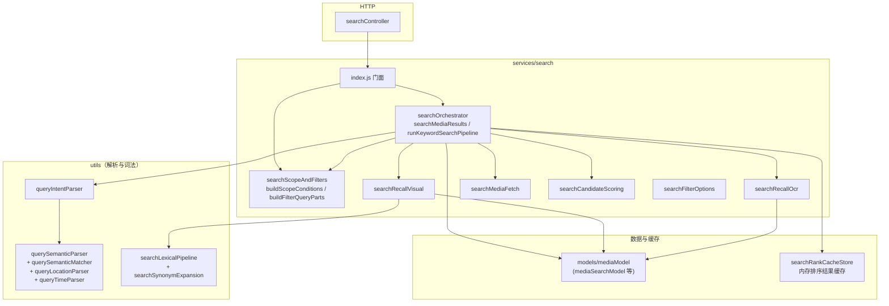
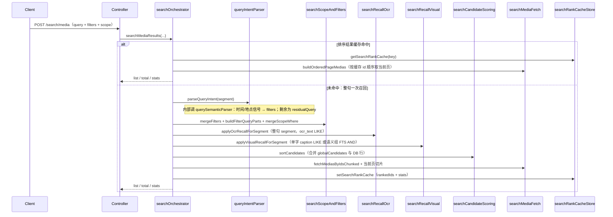

# 搜索服务架构与数据流总览

本文面向需要阅读或改动 `xiaoxiao-album-api` 搜索相关代码的同学：**用一张心智地图把「入口 → 编排 → 各路召回 → 排序分页」串起来**，再按需下钻到 `utils/` 与各子文档。  
**不替代**专题文档：全文 FTS、OCR、词表、自然语言理解层设计等细节仍以对应说明为准（见文末「相关专题文档」）。

> **2026-07-07：** 视觉侧为 **语义组 FTS AND** + **单字 caption LIKE**；已移除 `media_search_terms` 与动作词 `rankVerbs` 调试输出。理解入口：`searchLexicalPipeline.js` → `searchRecallVisual.js`。

---

## 1. 文档目的

| 问题 | 本文做什么 |
|------|------------|
| 搜索请求从哪进、先到哪一层？ | 给出入口与分层 |
| `query`、`filters`、`scope` 怎么变成 SQL？ | 给出数据流与模块职责 |
| `residual`、语义组 AND、OCR/视觉分别在哪？ | 给出名词表与文件映射 |
| 新人从哪个文件读起？ | 给出推荐阅读顺序 |

---

## 2. HTTP 入口

| 路径 | 作用 |
|------|------|
| `POST /search/media`（见 `routes/searchRoutes.js` → `searchController.handleSearchMedias`） | 统一「搜索 / 范围内列表」：`body.query`、`filters`、`scope（source/type/albumId/clusterId）`、`pageNo`、`pageSize` |
| `GET /search/filters` | 分页拉取筛选项（城市、年、月、星期等），可带 scope 缩小维度 |

控制器内：`runSearchMediaFlow` 根据是否有有效关键词（非空且非 `*`）分支调用 `searchService.searchMediaResults`。

---

## 3. 分层架构（模块职责）

**要点**：

- **编排只放在 `searchOrchestrator.js`**：意图合并、WHERE 合并、OCR/视觉召回、候选排序、分页、排序缓存；不写具体分词/语义组公式。
- **`searchScopeAndFilters.js`**：把前端的 `filters` + `filterOptions` 转成 SQL 片段；`buildScopeConditions` 把「收藏 / 时间轴 / 相册 / 地点 / 人物」等范围转成 `WHERE`；内部复用 `utils/buildSearchQueryParts.js`。
- **`utils/` 下多文件**：多为「自然语言 → 结构化筛选 + residual」与「语义组 / 同义词 / 词法」，服务于 `searchRecallVisual` 与索引侧，而非重复实现两套搜索。

---

## 4. 关键词搜索数据流（主路径）

以下为 `searchMediaResults` 在 **`query` 非空且不是 `*`** 时的逻辑概要（与代码顺序一致）。

**设计约定（实现注释与代码一致）**：

- **整句一次召回**：用户输入作为单个 `segment`，**不按空格拆成多轮循环**；空格可在 OCR/词法子模块内作为句内多线索处理。
- **`residual` vs `segment`**：`segment` 用于 OCR（整句）；`residual` 用于视觉侧（单字 LIKE 或语义组 FTS AND）。

---

## 5. 无关键词分支（仅筛选 / 范围内列表）

当 `query` 为空或等价于「仅筛选」时（控制器侧常把缺省打成 `*`，`hasQuery` 为 false 时走另一支）：

- 控制器把 **scope 的 WHERE** 与 **`buildFilterQueryParts(filters)`** 合并后，以 **`ftsQuery: null`** 调用 `listMediaSearchResults` / `countMediaSearchResults`（见 `searchOrchestrator` 前半段）。
- **不经过** OCR/视觉召回管线，也不写入排序结果缓存（该缓存仅服务于有关键词的排序路径）。

---

## 6. 名词表（与代码概念对齐）

| 名词 | 含义 | 主要落点 |
|------|------|----------|
| **segment** | 用户输入的整句检索文本（关键词路径下与 `normalizedQuery` 相同） | `runKeywordSearchPipeline` → OCR、视觉子模块 |
| **residual** | 去掉自然语言时间、地点等后的剩余查询，用于视觉侧 | `parseQueryIntent` → `residualQuery` |
| **baseFilters / mergedFilters** | 侧栏等传入的筛选 + 搜索框解析出的结构化条件合并 | `mergeFilters`（不覆盖用户已选条件） |
| **scope** | 列表范围：收藏、时间轴、相册、地点、人物等 | `buildScopeConditions` |
| **globalCandidates** | `mediaId → 打分/来源信息` 的内存 Map，多路召回汇入 | `searchOrchestrator`、`searchCandidateScoring` |
| **语义组（semantic group）** | jieba must token 经同义词扩成一组；**组内 OR、组间 AND** | `searchLexicalPipeline.js` → `searchRecallVisual.js` |
| **排序缓存** | 同一查询键下缓存「已排好序的 mediaId 列表 + stats」，翻页复用 | `searchRankCacheStore`（TTL、容量见源码常量） |

---

## 7. 推荐阅读顺序（第一次读代码）

1. **`services/search/searchOrchestrator.js`**：主流程与分支（缓存、无结果、排序分页）。
2. **`controllers/searchController.js`**：`runSearchMediaFlow` 如何区分 `hasQuery` 与拼 WHERE。
3. **`services/search/searchScopeAndFilters.js`**：scope 与 `buildSearchQueryParts` 的衔接。
4. **`utils/queryIntentParser.js`** → **`utils/querySemanticParser.js`**：从自然语言抽出结构化筛选与 `residualQuery`。
5. **`services/search/searchRecallOcr.js`**：OCR `LIKE` 与整句/分段关系。
6. **`utils/searchLexicalPipeline.js`** + **`services/search/searchRecallVisual.js`**：query 分词、语义组、单字 caption LIKE / FTS 召回与交集。
7. **`services/search/searchCandidateScoring.js`**：多路召回合并与最终排序。
8. **`utils/searchRankCacheStore.js`**：排序缓存键构成与失效语义。

再按需深入：`searchLexicalPipeline.js`、`searchSynonymExpansion.js`、`buildSearchQueryParts.js`、`models/mediaModel` 下搜索相关 SQL；整体设计见 [自然语言搜索理解层设计方案.md](./自然语言搜索理解层设计方案.md)。

---

## 8. 响应中的 `stats` 字段

关键词搜索路径返回的统计（见 `searchOrchestrator` 与管线返回值）大致对应：

| 字段 | 含义 |
|------|------|
| `captionLikeCount` | 单字 query 在 `caption_search_terms` 上 LIKE 命中行数 |
| `ftsCount` | 视觉 FTS 分组命中行数 |
| `ocrCount` | OCR `LIKE` 路径命中行数 |

> **已移除：** `semanticCount`（文字向量召回统计）。搜索侧不再使用 `visual_text` 向量（决策 D2/D9）。

（具体计数口径以实现为准，调试时可结合 `scripts/diagnose-search-vs-person-cluster.js`。）

---

## 9. 环境变量与行为（摘录）

排序缓存 TTL、最大条数见 `utils/searchRankCacheStore.js` 内常量（当前为 **60s**、**最多 20 条键** 量级，以源码为准）。

> **搜索侧已不再读取** `VISUAL_EMBEDDING_*`。入库侧 `mediaEmbeddingRebuildService` 仍可写入 `visual_text` 向量，供非搜索能力或未来功能使用。

---

## 10. 相关专题文档（下钻细节）

| 主题 | 文档 |
|------|------|
| 自然语言理解层设计与 P0/P1/P2 边界 | [自然语言搜索理解层设计方案.md](./自然语言搜索理解层设计方案.md) |
| **词表扩充（入库/出库对照）** | [搜索词表与维护说明.md](./搜索词表与维护说明.md) |
| FTS5 与 `media_search` | [FTS全文检索链路说明.md](./FTS全文检索链路说明.md) |
| OCR 搜索 | [OCR搜索链路说明.md](./OCR搜索链路说明.md) |
| 视觉文本向量（**搜索侧已停用，历史参考**） | [视觉文本向量搜索链路说明.md](./视觉文本向量搜索链路说明.md) |

---

## 11. 修订说明

- 本文描述以 `xiaoxiao-album-api/src/services/search/searchOrchestrator.js` 及相关模块为准；若重构入口或缓存策略，请同步更新本节与图示。
- **2026-06-25：** P2 聚焦词表维护；D1 少结果 UI、交互 P2、排序/UI 增强 **暂不做**。词表对照见 [搜索词表与维护说明.md](./搜索词表与维护说明.md)。
