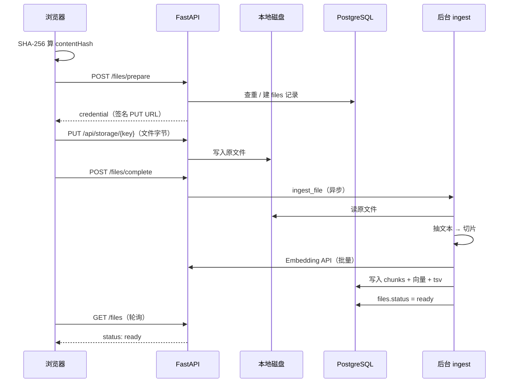
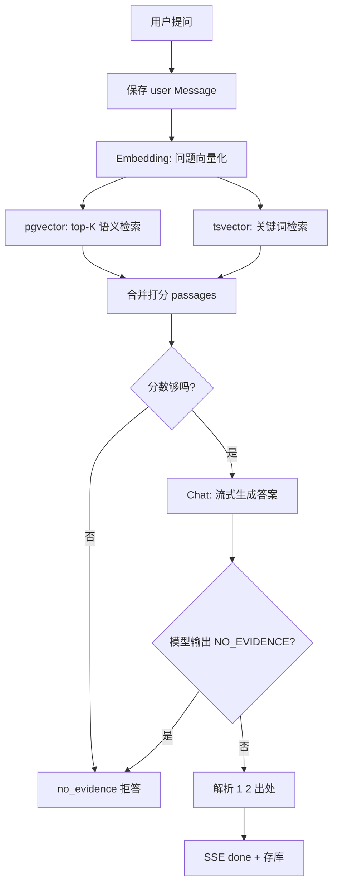

# 问牍 · 底层实现逻辑报告

> 面向开发者：从「上传一个文件」到「页面上看到带出处的 Markdown 回答」，整条链路如何运转；**Embedding 模型**与**对话（Chat）模型**分别在哪些环节介入、起什么作用。

> **规格方向（2026-08-25）：** 当前阶段仅自托管；**Embedding 内置本地**（multilingual-e5-small，384 维），管理页只配 Chat 三项。实现见 `apps/api/app/embed.py` 与 `docs/spec/04-技术设计.md`。

代码入口速查：

| 环节 | 主要文件 |
|------|----------|
| 上传 API | `apps/api/app/routers_files.py` |
| 本地磁盘存储 | `apps/api/app/storage.py` |
| 解析 / 切片 / 入库 | `apps/api/app/ingest.py` |
| 本地 Embedding | `apps/api/app/embed.py` |
| Chat 模型调用 | `apps/api/app/llm.py` |
| 检索 + 问答 | `apps/api/app/rag.py` |
| 问答 API（SSE） | `apps/api/app/routers_ask.py` |
| 前端上传 | `apps/web/src/components/workspace/FileSidebar.vue` |
| 前端问答 + Markdown | `apps/web/src/composables/useAskSession.js` · `AskPanel.vue` · `lib/renderAnswerMd.js` |

---

## 1. 整体架构（一图看懂）

问牍是典型的 **RAG（Retrieval-Augmented Generation，检索增强生成）** 应用：不把整个文件塞进大模型上下文，而是先把文件切成小段、向量化存进数据库；提问时先**检索**最相关的几段，再让**对话模型只根据这几段**组织答案。

```
┌──────────────┐     HTTP/SSE      ┌─────────────────────────────────────┐
│  Vue 前端     │ ◄──────────────► │  FastAPI 后端                        │
│  工作台/问答  │                   │  auth · files · ask · admin         │
└──────────────┘                   └──────────┬──────────────────────────┘
                                              │
                    ┌─────────────────────────┼─────────────────────────┐
                    │                         │                         │
                    ▼                         ▼                         ▼
            ┌───────────────┐        ┌───────────────┐        ┌─────────────────┐
            │ 本地磁盘       │        │ PostgreSQL     │        │ OpenAI 兼容 API  │
            │ data/files/   │        │ + pgvector     │        │ Chat + Embedding │
            │ 原文件        │        │ 元数据/切片/向量│        │ （用户自配 Key）  │
            └───────────────┘        └───────────────┘        └─────────────────┘
```

**两类模型分工（核心）：**

| 模型 | 配置项（管理页） | 何时调用 | 作用 |
|------|------------------|----------|------|
| **Embedding（向量）模型** | `Embedding 模型` + `向量维度` | ① 文件入库时，对每个切片向量化<br>② 用户提问时，把问题向量化 | 把「文本」变成「向量」，用于**语义相似度检索**（找相关段落） |
| **Chat（对话）模型** | `对话模型` | 检索到相关段落后，生成最终回答 | **只根据检索到的片段**写人话答案，并标注 `[1][2]` 出处编号 |

二者都走同一 `Base URL` + `API Key`（OpenAI 兼容接口，如百炼 DashScope 的 compatible-mode）。

---

## 2. 数据存在哪里

### 2.1 原文件 → 本地磁盘

- 环境变量 `FILES_DIR`，默认 `data/files/`（Docker 下常挂载卷）。
- 每个文件的路径规则：`{user_id}/{file_id}{扩展名}`，例如  
  `data/files/5c7f8475-.../502aa556-....csv`
- 实现类：`LocalStorage`（`storage.py`）。浏览器**不经过 API 长期中转字节**，而是用短时 HMAC 签名 URL 直接 `PUT` 到 `/api/storage/{key}`。

### 2.2 元数据与「可检索内容」→ PostgreSQL

| 表 | 存什么 |
|----|--------|
| `files` | 文件名、哈希、磁盘 key、状态（pending/processing/ready/failed） |
| `chunks` | 每个切片的**纯文本**、**embedding 向量**、**全文检索 tsvector** |
| `conversations` / `messages` | 多轮对话与问答记录 |
| `citations` | 某条回答引用了哪个 chunk、原文 snippet |
| `instance_settings` | 实例级 LLM 配置（Key、Base URL、两个模型名、向量维度） |

向量列使用 **pgvector** 扩展；关键词列 `tsv` 使用 Postgres 内置全文检索（`simple` 分词配置，不依赖中文分词器）。

---

## 3. 上传流程（从拖到页面到「处理完成」）

### 3.1 前端（`FileSidebar.vue`）

1. 用户选择或拖入文件。
2. 浏览器用 Web Crypto 算 **SHA-256**（`sha256File`）→ 得到 `contentHash`。
3. `POST /api/files/prepare`，带上文件名、大小、哈希。
4. 若返回 `type: instant` → 同内容已成功上传过，**秒传**，不再传字节。
5. 若返回 `type: upload` → 拿到 `credential`（含签名 PUT URL），`directUpload` 把文件 PUT 到 `/api/storage/...`。
6. `POST /api/files/complete` → 通知后端「磁盘上已有文件，开始处理」。

### 3.2 后端 prepare（`routers_files.py`）

- 校验扩展名（pdf/md/txt/docx/pptx/csv/xlsx）与大小（≤ 20MB）。
- 同用户 + 同 `content_hash` 且状态为 ready/pending/processing → 直接返回已有记录（秒传）。
- 否则创建 `files` 行（`status=pending`），生成 `storage_key`，返回上传凭证。

### 3.3 后端 complete → 异步 ingest

- 确认磁盘上对象存在 → `status=processing`。
- 通过 FastAPI `BackgroundTasks` 调用 `ingest_file(file_id)`（不阻塞 HTTP 响应）。
- 前端轮询 `GET /files` 看状态，直到 `ready` 或 `failed`。

### 3.4 流程图



---

## 4. 文件入库（ingest）——Embedding 模型第一次登场

代码：`ingest.py` → `ingest_file()`

### 4.1 从磁盘读出并抽文本

按扩展名调用不同提取器（**不做 OCR**，扫描件 PDF 可能抽不到字）：

| 格式 | 方式 |
|------|------|
| `.md` / `.txt` | 按 utf-8 / gb18030 等解码 |
| `.pdf` | `pypdf` 逐页 `extract_text` |
| `.docx` | `python-docx` 段落 + 表格 |
| `.pptx` | `python-pptx` 每页文本框 |
| `.csv` / `.xlsx` | 行/单元格拼成 ` \| ` 分隔的纯文本 |

得到一整段字符串 `raw`。

### 4.2 切片（chunk）

- 先把空白规范化成单空格。
- 按固定窗口滑动切分（默认来自 `.env` / `config.py`）：
  - `CHUNK_SIZE=500` 字符
  - `CHUNK_OVERLAP=80` 字符重叠（避免一句话被拦腰截断）
- 得到 `pieces: list[str]`，例如几十到几百个切片。

### 4.3 向量化 —— **Embedding 模型**

调用 `llm.embed_texts(pieces)`：

```http
POST {base_url}/embeddings
{
  "model": "{embed_model}",
  "input": ["切片1", "切片2", ...],   // 每批最多 10 条
  "dimensions": {embed_dim}           // 如 1024
}
```

返回每个切片的浮点向量（长度 = `embed_dim`）。

**作用：** 把「这段文字的含义」编码成高维向量，之后可以用**余弦/欧氏距离**找「和问题语义最接近的段落」。  
**注意：** 若此时模型未配置或 API 失败，ingest 失败，`files.status=failed`。

### 4.4 写入数据库

- 删除该文件旧 chunks（重传时覆盖）。
- 每个 chunk 一行：`text`、`embedding`、序号 `ordinal`。
- 执行 SQL：`UPDATE chunks SET tsv = to_tsvector('simple', text)` —— 为**关键词检索**建索引。

最后 `files.status = ready`，用户才能在问答里用到这份材料。

---

## 5. 问答流程 —— 两种模型如何配合

代码：`routers_ask.py` → `rag.ask_stream()`

### 5.1 前端发起提问

1. `useAskSession.submit()` 把用户问题 push 进本地 `messages`，并插入一条 `streaming: true` 的 assistant 占位。
2. `POST /api/ask`，body：`{ question, conversationId, fileIds? }`。
3. 响应用 **SSE（Server-Sent Events）** 流式返回，前端 `fetch` + `ReadableStream` 解析 `event: delta` / `event: done`。

可选 `fileIds`：只在该用户指定的、已 ready 的文件里检索（拖文件进提问框时）。

### 5.2 后端：保存用户消息 → 检索

1. 校验对话归属、是否有 ready 文件。
2. 写入一条 `role=user` 的 `Message`。
3. 调用 `retrieve(db, user_id, question, file_ids)`。

### 5.3 检索（retrieve）—— **Embedding 模型第二次登场**

**步骤 A：向量检索（语义）**

1. `embed_query(question)` → 对**用户问题**再调一次 Embedding API，得到 `qvec`。
2. SQL（pgvector）在**当前用户的 chunks** 里找与 `qvec` 最接近的 top-K（默认 `RETRIEVE_K=8`）：

```sql
ORDER BY c.embedding <=> CAST(:qvec AS vector)   -- 距离越小越相似
LIMIT :k
```

每条结果带 `vec_score = 1 - 距离`（越大越相似）。

**步骤 B：关键词检索（兜底）**

```sql
WHERE c.tsv @@ plainto_tsquery('simple', :q)
```

命中专有名词、编号、英文路径等「字面高度匹配」的内容。  
若向量 API 临时失败（`EMBED_FAILED`），**整段向量检索跳过**，仅走关键词。

**步骤 C：合并打分**

- 同一切片既向量命中又关键词命中 → 分数 +0.05。
- 仅关键词命中 → 给一个基础分（`vector_min_score`）。
- 按分数排序，取前 K 条 → `passages` 列表（每项含 `filename`、`text`、`score`）。

### 5.4 是否「够格回答」

`_passages_sufficient(passages)`：

- 没有段落 → **拒答**（`no_evidence`）。
- 最高分 `< VECTOR_MIN_SCORE`（默认 0.28）→ **拒答**。
- 最高分 ≥ `VECTOR_STRONG_SCORE`（0.38）→ 认为足够。
- 中间地带 → 若有关键词命中也算足够。

**设计意图：** 检索分太低说明材料里很可能没有相关内容，**不让 Chat 模型硬编**，直接走「材料里没有」。

### 5.5 生成回答 —— **Chat 模型登场**

调用 `stream_answer(question, passages)`：

1. 把检索到的段落编号拼进 Prompt：

```
[1] file=报告.pdf
（切片原文…）

[2] file=表格.xlsx
（切片原文…）

Question:
用户的问题
```

2. **System Prompt 约束（关键）：**

- **只许**根据 Passages 回答；
- **禁止**用材料外的世界知识；
- 语言与用户问题一致；
- 无关或依据不足 → 只输出 magic 字符串 `__NO_EVIDENCE__`；
- 正常回答时用 `[1]`、`[2]` 标注引用；
- 允许轻量 Markdown（加粗、列表、行内代码），不要 JSON / 代码围栏。

3. **Chat API 流式调用：**

```http
POST {base_url}/chat/completions
{
  "model": "{chat_model}",
  "temperature": 0,
  "stream": true,
  "messages": [
    { "role": "system", "content": "..." },
    { "role": "user", "content": "Passages:...\n\nQuestion:..." }
  ]
}
```

4. 每个 token 增量通过 SSE `event: delta` 推给前端；前端逐字追加到 `msg.content`。

**Chat 模型的作用：** 不是「从脑子里想答案」，而是**阅读检索到的片段、归纳成流畅句子、并打上出处编号**。  
**temperature=0** 降低随机性，提高事实稳定性。

### 5.6 结束：出处解析与落库

1. 若完整回答含 `__NO_EVIDENCE__` → 存 `no_evidence` 类型消息，界面显示礼貌拒答文案。
2. 否则 `citations_from_answer(text, passages)`：
   - 用正则找回答里的 `[1]`、`[2]`…
   - 映射回对应 chunk，写入 `citations` 表（filename + snippet）。
3. SSE `event: done` 带上 `{ type, text, citations }`；前端关闭 streaming，展示出处折叠块。

### 5.7 问答全流程图



---

## 6. 为什么「能找对、能答对」—— 以及它的边界

### 6.1 为什么经常能答对

1. **检索先行：** 先从你的文件里捞出最相关的 8 段左右原文，Chat 模型看到的上下文**就是材料本身**，而不是全网知识。
2. **双路检索：** 向量抓语义（「定价多少」≈「统一定价 ¥198」）；关键词抓字面（SKU 编号、API 路径、人名）。
3. **低温度生成 + 强 Prompt：** 要求 cite `[n]`，且明确禁止瞎编。
4. **分数门槛：** 检索太弱直接拒答，避免「看起来在答其实在编」。
5. **切片重叠：** 500 字窗口 + 80 字重叠，减少关键句被切断导致检索不到。

### 6.2 为什么会错或拒答

| 情况 | 原因 |
|------|------|
| 扫描版 PDF 无文字层 | 抽不出文本， ingest 失败或 chunks 为空 |
| 答案在表格跨行/跨页 | 切片边界可能切断结构，检索片段不完整 |
| 问题太泛或材料确实没有 | 分数低于阈值 → 正确拒答 |
| Embedding 与 Chat 不是同一语义空间/语言 | 跨语言或模型不匹配时检索变弱 |
| 模型无视 Prompt 幻觉 | 概率低但存在；出处 `[n]` 可人工核对 |

**产品承诺：** 「只答材料里的」> 「永远 100% 正确」。正确性依赖检索质量 + Prompt + 用户可点的原文 snippet。

---

## 7. 问答页为何以 Markdown 形式显示

### 7.1 模型侧

System Prompt 允许 *Light Markdown*（加粗、列表、行内代码），所以 Chat 模型输出可能是：

```markdown
免费试用 Pro **14 天** [1]。
```

### 7.2 前端渲染（`AskPanel.vue` + `renderAnswerMd.js`）

1. 流式过程中：`pair.answer.content` 是纯文本/markdown 字符串，**边收边渲染**。
2. 每次渲染调用 `renderAnswerHtml(content)`：
   - **`marked`** 库：Markdown → HTML（开启 `gfm`、`breaks`）。
   - **`DOMPurify.sanitize`**：去掉 XSS 危险标签，再 `v-html` 注入。
3. CSS（`.atext :deep(...)`）控制段落、列表、加粗、行内 code 的排版。
4. 流式未结束时显示闪烁光标 `▍`；**出处**在 `streaming=false` 且 `done` 到达后才展示（避免引用编号还没写完）。

**因此：** 不是「聊天框自带 Markdown 编辑器」，而是 **模型输出 Markdown 字符串 → 前端实时预览渲染**。

---

## 8. 配置与模型在启动时的关系

- 模型配置存在 `instance_settings` 表（管理页写入），**不在 `.env` 里配 Key**。
- `llm._llm_config()` 每次调用前读 DB；缺任一字段 → `LLM_NOT_CONFIGURED`。
- **Embedding 维度** 由 `config.default_embed_dim`（384）与 `chunks.embedding` 列一致；换模型/改维度须清材料重 ingest。
- 默认检索参数（`config.py`）：

| 变量 | 默认 | 含义 |
|------|------|------|
| `CHUNK_SIZE` | 500 | 切片字符数 |
| `CHUNK_OVERLAP` | 80 | 切片重叠 |
| `RETRIEVE_K` | 8 | 每次问检索几条 |
| `VECTOR_MIN_SCORE` | 0.28 | 最低接受相似度 |
| `VECTOR_STRONG_SCORE` | 0.38 | 高置信阈值 |

---

## 9. 一次完整用户旅程（串联）

以「上传 `planted-notes.txt` 并问工单号」为例：

1. **上传** → 磁盘 `data/files/{uid}/{fid}.txt`
2. **ingest** → 抽文本 → 1～N 个 chunk → **Embedding API** → 向量进 `chunks`
3. **提问**「唯一工单号是多少？」
4. **Embedding API** 把问题转向量 → pgvector 找到含 `WENDU-TXT-NOTE-6610` 的 chunk（向量 + 关键词）
5. **Chat API** 读 `[1] file=planted-notes.txt\n...工单号...`，输出「唯一工单号是 WENDU-TXT-NOTE-6610 [1]」
6. 解析 `[1]` → `citations` 存 snippet
7. 前端 **marked** 渲染 → 用户看到加粗/列表排版 + 可展开出处

自动化回归脚本 `apps/web/scripts/e2e-answer-quality.mjs` 即覆盖这条链（24 项全 PASS）。

---

## 10. 与「桌面 / 自托管」规格的关系（实现视角）

当前**已实现代码**为自托管 Web（Cookie 登录 + 管理页配模型）。规格中的桌面形态（无登录、先 `/setup`）会在**身份层与路由**分叉，**第 3～7 节 RAG 核心不变**：仍是磁盘原文件 + Postgres chunks + Embedding 检索 + Chat 生成。

---

## 11. 进一步阅读

- 产品规则与失败文案：`docs/spec/02-产品设计.md`
- API 契约：`docs/spec/04-技术设计.md`
- 规格索引：`docs/spec/00-索引.md`

---

*文档版本：2026-08-24，对应当前 `main` 分支实现。*
